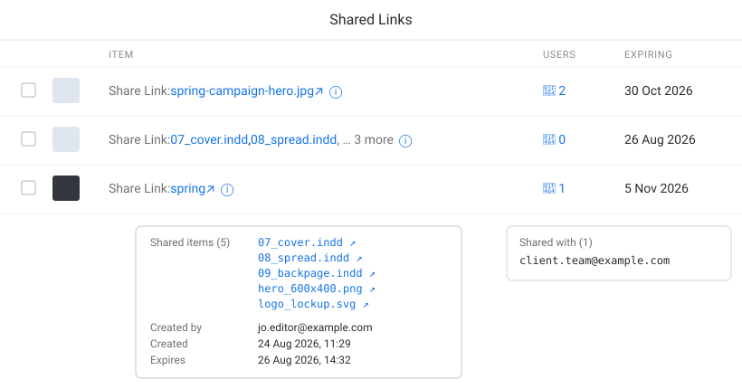
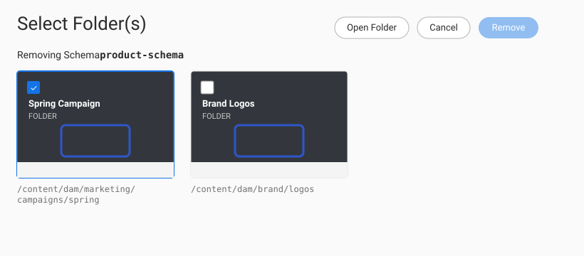

# AEM Toolbelt 🧰

[](https://github.com/bmxcode/aem-toolbelt/actions/workflows/ci.yml)
[](https://github.com/bmxcode/aem-toolbelt/releases/latest)
[](LICENSE)

Client-side quality-of-life enhancements for the Adobe Experience Manager (AEM) Assets Touch UI
console. AEM often **already has useful information in the page DOM** but never renders it, forcing
admins and developers into browser DevTools to read an attribute by hand. AEM Toolbelt surfaces that
information as visible text and clickable links.

It ships two ways from **one shared codebase**:

- a **Tampermonkey userscript** — fastest to install and iterate, and
- an **MV3 Chrome extension** — cleaner for distributing to a team.

It's **client-side only**: no server deploy and no page-context scripts, so it stays clean under the
strict AEM as a Cloud Service CSP. It runs as the already-logged-in user and works on any instance
your browser can reach. The only network it does is the occasional same-origin, read-only `GET`
(e.g. the Shared Links info box fetches a share record's JSON on hover) — everything else just reads
the DOM and links you to existing AEM URLs.

## Screenshots

**Shared Links** — filenames as links (long shares collapse to "… N more"), an ⓘ info box with the
full item list and share details, and a separate emails popup on the users count. _(Illustrative;
sample data.)_



**Remove from Folder(s)** — a banner naming what's being removed, the folder path on each card, and
an Open Folder button (enabled when a single folder is selected). _(Illustrative; sample data.)_



## What it fixes today

| Console | Problem | Toolbelt adds |
| --- | --- | --- |
| **Remove from Folder(s)** wizard — used by Metadata Schemas, Folder Metadata Schemas, Metadata Profiles, Processing Profiles, Image Profiles, Video Profiles | Header doesn't say what's being removed; folder cards show only a title, no path; no way to open a folder | A "Removing _&lt;type&gt; &lt;name&gt;_" banner, the folder path on each card, and an **Open Folder** button next to Cancel (enabled when a single folder is selected) |
| **Assets › Shared Links** | Every row just says "Link share" — no idea which asset/folder, who it was shared with, or when | The shared item **filename(s) as links** (`Share Link: name ↗`; a long share shows the first two + "… N more"). An **ⓘ info box** on hover lists every shared item plus created-by, created/expiry dates, download/rendition permissions, and message. A **separate emails popup** on the USERS icon (only when the count is &gt; 0) lists who it was shared with. Folder shares (and other rows AEM leaves blank) are filled in from the share JSON. |
| **Assets › Metadata Schemas** | The list shows each form by its display **title** only — the node name (needed for CRXDE, packages, and the Remove-from-Folder wizard) and full path are hidden on the row | The full schema **path** as text, a **View JSON** link to the node's infinity JSON (`&lt;path&gt;.-1.json`), and a `node: &lt;name&gt;` chip shown **only when the node name differs from the visible title** |

Detection is by **DOM signature, not URL** — AEMaaCS console paths are non-obvious and change
between versions, so the enhancers simply look for their target elements and no-op otherwise.

## Install

**No build required:** grab the prebuilt files from the
[latest release](https://github.com/bmxcode/aem-toolbelt/releases/latest) —
`aem-toolbelt-<version>.user.js` (userscript) and `aem-toolbelt-extension-<version>.zip`
(unzip and Load unpacked). Otherwise build locally as below.

### Userscript (recommended to start)

1. Install the [Tampermonkey](https://www.tampermonkey.net/) extension in Chrome.
2. **Enable Developer mode** at `chrome://extensions` (top-right toggle). Recent Chrome versions
   require this for Tampermonkey to run userscripts — without it, scripts silently don't execute and
   Tampermonkey shows a warning.
3. Install the script:
   - **From a release (no npm):** download `aem-toolbelt-<version>.user.js` from the
     [latest release](https://github.com/bmxcode/aem-toolbelt/releases/latest). Then open the
     Tampermonkey **dashboard** → **Utilities** tab → under *Import*, choose the downloaded file
     (or just drag the `.user.js` file onto the dashboard). Tampermonkey shows an install page —
     click **Install**.
   - **From a local build:** `npm install && npm run build`, then import `build/aem-toolbelt.user.js`
     the same way.
4. Reload your AEM author tab.

It auto-runs on `*.adobeaemcloud.com` and `localhost:4502`.

- **Other AEM hosts (AMS / on-prem):** open the Tampermonkey dashboard → edit **AEM Toolbelt** → add
  a line like `// @match https://author.example.com/*` in the header block, and save.
- **Updating:** this userscript isn't wired for auto-update. To update, download the newer
  `.user.js` and import it again — Tampermonkey overwrites the existing script of the same name.
- **Verify it's on:** the Tampermonkey toolbar icon shows a badge with the number of active scripts
  while you're on an AEM tab.

### Chrome extension

**From a release (no npm):**

1. Download **`aem-toolbelt-extension-<version>.zip`** from the
   [latest release](https://github.com/bmxcode/aem-toolbelt/releases/latest).
2. **Unzip it.** Chrome loads the *folder*, not the zip — keep the unzipped folder somewhere
   permanent (Chrome reads it from disk on every launch; moving or deleting it breaks the extension).
3. Open `chrome://extensions`.
4. Toggle on **Developer mode** (top-right).
5. Click **Load unpacked** and select the unzipped folder. "AEM Toolbelt" appears in the list.
6. Optional: click the toolbar puzzle-piece icon and **pin** AEM Toolbelt for one-click access to its popup.

**From a local build:** run `npm install && npm run build`, then Load unpacked on `build/extension/`
(steps 3–6 above).

It auto-runs on `*.adobeaemcloud.com` and `localhost:4502`. For AEM hosts outside those (e.g. AMS or
on-prem), click the AEM Toolbelt icon and **Enable on this site**, then reload the tab.

**Updating:** unpacked extensions don't auto-update. Download the new zip, unzip over the same
folder, then click the refresh icon on the extension's card in `chrome://extensions`.

## Develop

```bash
npm install
npm run build      # one-off build → build/
npm run watch      # rebuild on change
```

### Add a new fix

1. Create `src/enhancers/<name>.js` that calls `register({ id, appliesTo, enhance })`.
2. Import it in `src/enhancers/index.js`.

That's it — no wrapper or build changes. `appliesTo()` is a DOM-signature test; `enhance()` decorates
the DOM idempotently (guard with `markOnce` from `src/core/dom.js`). The runner re-applies enhancers
on AEM's in-app navigation (`foundation-contentloaded`) and on DOM mutations.

See [CONTRIBUTING.md](CONTRIBUTING.md) for the full walkthrough, conventions, helper reference, and a
PR checklist.

## Project layout

```
src/core/        runner (nav/mutation handling), registry, DOM helpers
src/enhancers/   one file per console fix + index.js
wrappers/        userscript header + MV3 extension (manifest, popup)
build.mjs        esbuild: core+enhancers → userscript AND extension
```

## Disclaimer

AEM Toolbelt is an independent, community project. It is **not** affiliated with, endorsed by, or
sponsored by Adobe. "Adobe Experience Manager" and "AEM" are trademarks of Adobe, used here only to
describe what the tool works with. It reads the DOM of pages you are already authorised to view and
adds no new permissions; use it at your own discretion.

## License

MIT
